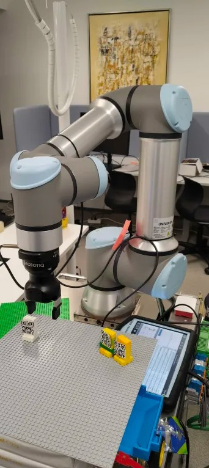
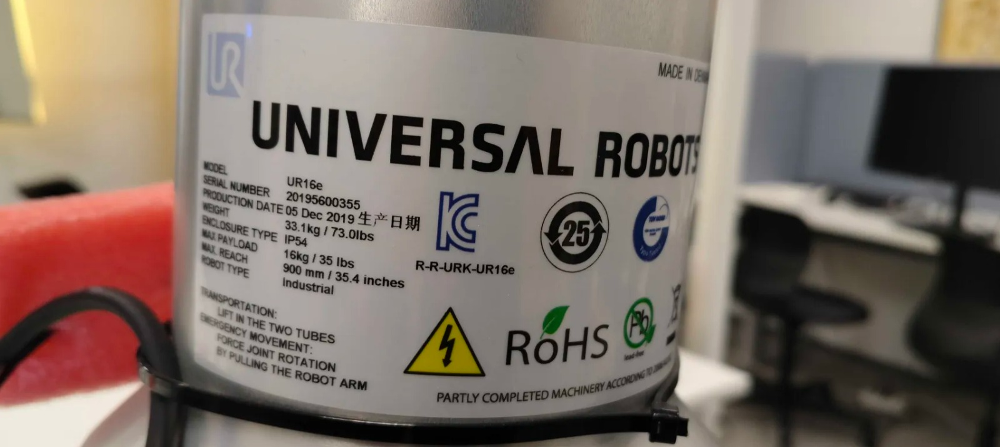
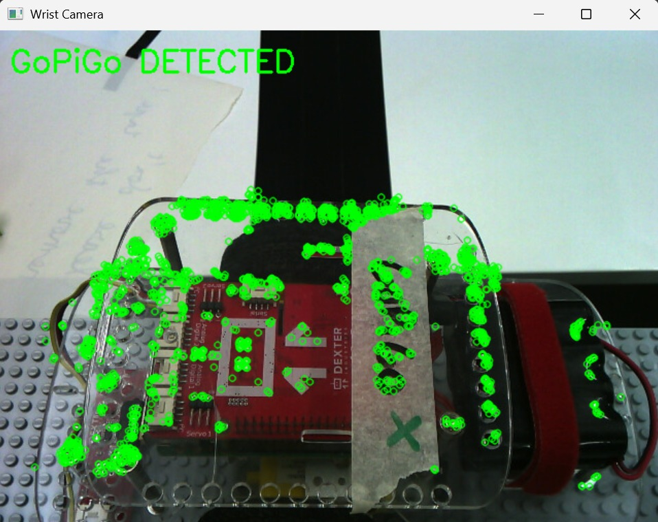
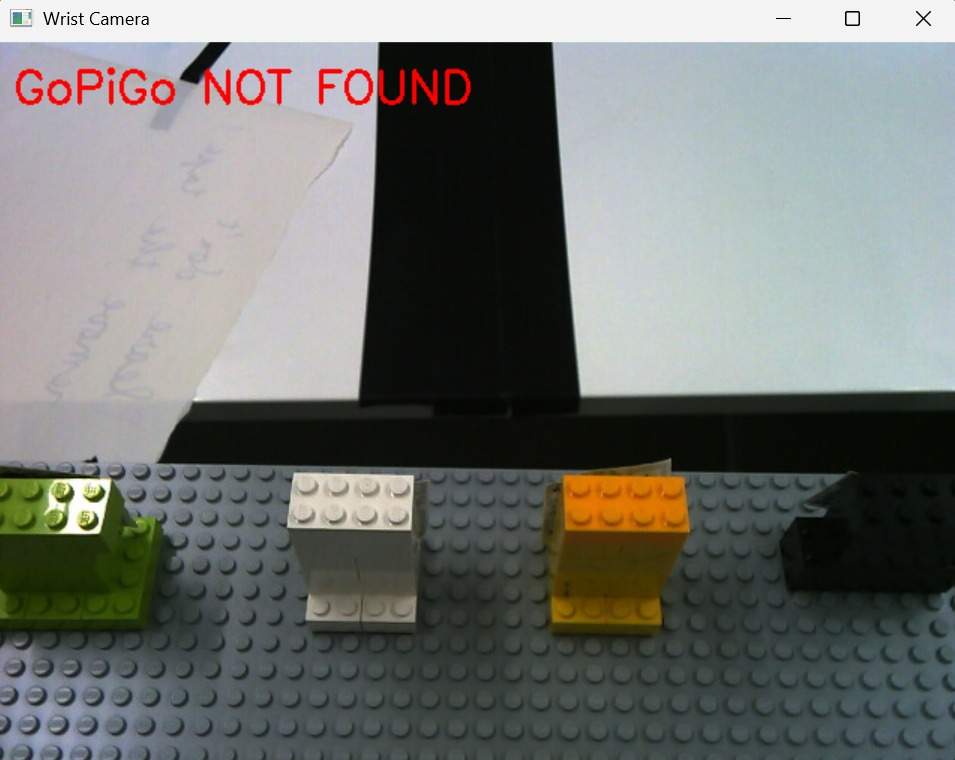

<h1 align="center">Universal Robots Arm for Warehouse Automation</h1>

<p align="center">
  
  
  
  
  
  
</p>

<table>
  <tr>
    <td style="text-align: center;">
      
      <br>UR Arm
    </td>
    <td style="text-align: center;">
      
      <br>Serial No.
    </td>
  </tr>
</table>

## Table of Contents

- [Project Overview](#project-overview)
- [Sequence of Operation](#sequence-of-operation)
- [Technology Stack & Libraries](#technology-stack-&-libraries)
- [Functionality Showcase](#functionality-showcase)
- [Prerequisites](#rerequisite)
- [Quickstart Guide](#quickstart-guide)

---

## Project Overview

This repository is a part of a larger project, which demonstrates a warehouse automation system built using three different types of robots; two Universal Robots arms, a Tello Edu drone, and a GoPiGo car. All robots communicate via a shared Websocket server, which gets notified of any orders that should be picked up from the warehouse using the project's own e-commerce website.

This repository contains the implementation for the first Universal Robots (UR) arm that implements the initial pick and place functionality in the warehouse. It has been created as a school project in Oulu University of Applied Sciences (OAMK).

---

## Sequence of Operation 

This Universal Robots (UR) arm is responsible for the initial automated pick and place operation in the warehouse workflow. Its task is to pick up ordered items from storage and place them onto a GoPiGo car.

1. **Order Triggered via Websocket**:
Once a GoPiGo car arrives at the designated loading station, it notifies the shared WebSocket server. The server then sends a "PICK_AND_PLACE" event to the UR arm controller, including the product ID corresponding to an order placed through the project’s e-commerce website.

2. **Movement Sequence Selection**:
Once the Universal Robots (UR) arm receives the event, it executes the movement sequence associated with the specified product ID. Each product the robot can pick up has its own corresponding movement sequence implemented as a Python module containing step-by-step functions that issue URScript commands. These modules are stored in the item_movement_sequences directory and are dynamically loaded using importlib. The movement sequences are run in a background thread using a ThreadPoolExecutor, since they would otherwise block the websocket connection.

3. **Vision**:
As the movement sequence for the selected product is running, a video feed from the robot’s wrist camera is continuously processed in a background thread. The feed is retrieved frame-by-frame and decoded using the OpenCV (cv2) library. This video feed is sent the the project's Websocket server for viewing.

4. **GoPiGo Detection**:
During each movement sequence, the UR arm pauses briefly above the loading station where the GoPiGo car is expected to be. While in this position, the system performs three checks to determine whether the GoPiGo is present in the camera’s field of view. If the GoPiGo is detected, the item is placed onto the car. If not, the item is returned to the shelf. To detect whether a GoPiGo is present in the camera’s view, the system uses ORB (Oriented FAST and Rotated BRIEF) feature detection.

5. **Response Message**:
After the operation is complete, either a successful or failed “PICK_COMPLETE” message is sent back to the Websocket server.

---

## Technology Stack & Libraries

### Languages 
- **URScript** is used to define the functions that control the Universal Robot (e.g. moving the gripper). It is the native programming language used by and created for Universal Robots. 
- **Python** is used to initialize a TCP/IP connection and send these defined URScript functions to the Universal Robot controller via that connection. The Universal Robot controller then executes these functions. 

### Core Libraries 
- **Socket**: TCP/IP communication with the UR robot controller.
- **Asyncio**: lets code execute asynchronously and helps maintain a responsive websocket connection.
- **Websockets**: used to establish and maintain a websocket connection with our server (created by another student team).
- **Threading**: used to run the wrist camera video feed in a background thread.
- **ThreadPoolExecutor**: used to run blocking functions (run_custom_sequence) in a separate thread without blocking the asyncio event loop that manages the websocket connection.
- **Importlib**: dynamically loads the correct movement sequences based on the product code.
- **Dotenv**: load configuration variables from a .env file.
- **OpenCV (cv2)**: handles frame decoding and visual processing for GoPiGo detection.
- **Sys**: handles system-level interactions, like exiting the program. 
- **Time**: used to manage timing and synchronization between commands.

---

## Functionality Showcase

### Video Demonstration

### GoPiGo Detection (ORB Feature Matching)

<table>
  <tr>
    <td style="text-align: center;">
      
      <br>GoPiGo Detected
    </td>
    <td style="text-align: center;">
      
      <br>GoPiGo Not Found
    </td>
  </tr>
</table>

## Prerequisites

To successfully set up and run this project, you will need:

### 1. Hardware

- **Universal Robots** arm (here UR16e was used, but lower versions should work too).
- A robotiq gripper attached to the tool flange.
- A host device with an available **Ethernet** port.

### 2. Network Configuration

The Universal Robots (UR) arm requires a static IP address for reliable communication. The default range for many UR arms is **192.168.100.x**.

1.  Plug the UR arm into its power source.
2.  Connect the UR arm to the host device via an **Ethernet cable**.
3.  Set a **static IP address** on your host PC's Ethernet adapter (Windows example below):

    ```
    # Run this command in Command Prompt (Admin) or PowerShell
    netsh interface ip set address name="Ethernet" static 192.168.100.10 255.255.255.0 none
    ```

4.  Verify the connection by pinging the robot's default IP (adjust `192.168.100.20` if your robot's IP is different):

    ```bash
    ping 192.168.100.20
    ```

    You should receive successful replies.

---

## Quickstart Guide

Follow these steps to run the Universal Robots arm pick and place code.

### Clone the Repository

```bash
git clone https://github.com/Robotics-project-2025-DIN23SP/ur-robot-arm.git
```

### Install the required Python packages using pip.

### Run the code

#### Option 1: Run Pick and Place (No Websocket)

```bash
python sequence_runner.py
```

#### Option 2: Run with Websocket Server (Requires .env)

```bash
python websocket_handler.py
```

The .env file expects the following format

```
URL = "(url of the websocket server)"
SECRET_TOKEN = "(password for the websocket server)"
```

---